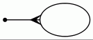
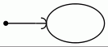

### DOT语言语法规则

```
     graph: [ strict ] (graph | digraph) [ ID ] '{' stmt_list '}'
 stmt_list: [ stmt [ ';' ] stmt_list ]
      stmt: node_stmt |	edge_stmt |	attr_stmt |	ID '=' ID |	subgraph
 attr_stmt: (graph | node | edge) attr_list
 attr_list: '[' [ a_list ] ']' [ attr_list ]
    a_list: ID '=' ID [ (';' | ',') ] [ a_list ]
 edge_stmt: (node_id | subgraph) edgeRHS [ attr_list ]
   edgeRHS: edgeop (node_id | subgraph) [ edgeRHS ]
 node_stmt: node_id [ attr_list ]
   node_id: ID [ port ]
      port: ':' ID [ ':' compass_pt ] |	':' compass_pt
  subgraph: [ subgraph [ ID ] ] '{' stmt_list '}'
compass_pt: (n | ne | e | se | s | sw | w | nw | c | _)
```

#### 箭头样式

```
    arrowname:	aname [ aname [ aname [ aname ] ] ]
        aname:	[ modifiers ] shape
    modifiers:	[ 'o' ] [ side ]
         side:	'l' | 'r'
        shape:	box | crow | curve | icurve | diamond |	dot | inv |	none | normal |	tee | vee
```

| shape         | 效果                                      |
| :---          | :---                                      |
| box           |            |
| crow          |          |
| curve         |        |
| diamond       |    |
| dot           |            |
| icurve        |      |
| inv           |            |
| none          |          |
| normal        |      |
| tee           |            |
| vee           |           |


#### 配色方案

* [默认X11配色方案](assets/x11-color-scheme.html)
* [支持SVG配色方案](assets/svg-color-scheme.html)
* [详情](https://graphviz.gitlab.io/_pages/doc/info/colors.html)


#### 主要参考

* [官网地址][graphviz]
* [新官网地址][new-graphviz]


[graphviz]: https://www.graphviz.org/ "Graphviz"
[new-graphviz]: https://www2.graphviz.org/ "Graphviz"
